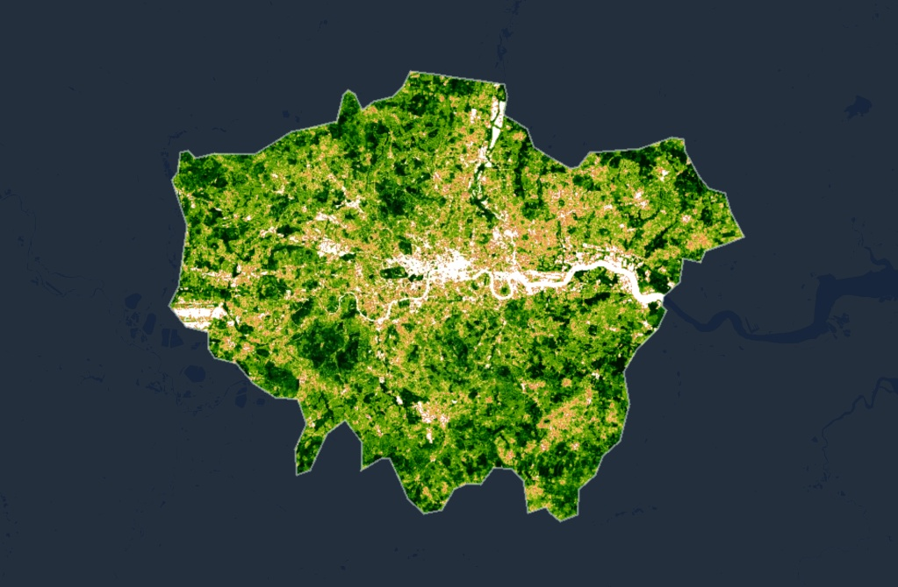
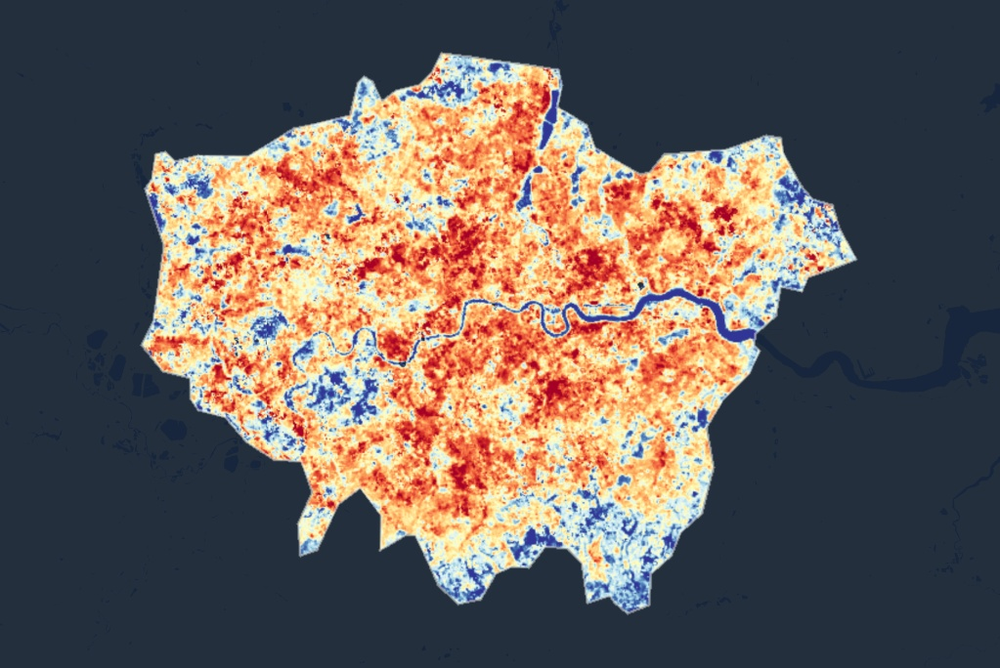

## Summary: Sensor Data & Policy Levels

This week, the focus shifted from technical operations, such as image preprocessing and classification, to the strategic use of Earth Observation (EO) data within urban policy frameworks. A key challenge highlighted in class is the frequent disconnect between academic remote sensing research and actionable guidance for local government.

Urban policies operate across multiple levels:

-   **Global agenda:** e.g., United Nations Sustainable Development Goal 11 (Sustainable Cities), which sets broad targets for safe, inclusive, and green urban spaces.
-   **Metropolitan strategy:** e.g., *The London Plan*, providing statutory guidance to address climate risks, including heatwaves.
-   **Local implementation:** Borough-level authorities must translate strategic goals into practical urban design requirements.

For this exercise, I selected **Greater London**, focusing on two intersecting policies: **Policy G5 (Urban Greening Factor)** and **Policy SI4 (Managing Heat Risk)**. The main challenge is that although the Greater London Authority (GLA) sets “net greening” targets to mitigate urban heat islands (UHI), local boroughs require high-resolution spatial evidence to identify vulnerable communities and implement standards effectively.

------------------------------------------------------------------------

## Applications: Linking EO Data to The London Plan

To demonstrate how EO data directly supports climate-resilient planning goals, I generated two spatial datasets for summer 2023 using **Google Earth Engine (GEE)**:

-   Extracted **Normalized Difference Vegetation Index (NDVI)** to represent green infrastructure (Policy G5).\
-   Extracted **Land Surface Temperature (LST)** to represent high-heat risk areas (Policy SI4).

### Spatial Evidence

::::: {style="display:flex; align-items:flex-start; gap:12px;"}
::: {style="flex:1; text-align:center;"}
```         

<sub style="font-size:0.8em; line-height:1.2;">
  <strong>Figure 1:</strong> NDVI map of Greater London (summer 2023), highlighting vegetation coverage. Green areas indicate dense vegetation, providing cooling effects.
</sub>
```
:::

::: {style="flex:1; text-align:center;"}
```         

<sub style="font-size:0.8em; line-height:1.2;">
  <strong>Figure 2:</strong> Land Surface Temperature (LST) map of Greater London (summer 2023). Red areas indicate high heat accumulation, blue/green areas indicate cooler surfaces.
</sub>
```
:::
:::::

## Reflection: Bridging Pixels to Planning

Mapping NDVI and LST only solves \~20% of the challenge. The remaining \~80% involves understanding governance structures: who holds budget authority, which stakeholders influence local decisions, and how EO data can be packaged to **save resources and reduce risk** for policymakers.

Policy interventions also require caution. While investing in green infrastructure is critical, it may trigger **green gentrification**, raising property prices and potentially displacing vulnerable residents.

**Future Directions:** - Anchor spatial analysis in local government responsibilities and budgets.\
- Transform EO-derived pixels into actionable urban governance tools.\
- Integrate with urban heat resilience, green equity, and disaster risk mapping studies.

------------------------------------------------------------------------

## References

-   GLA. (2021). *The London Plan: Policies G5 & SI4*. Greater London Authority.\
-   ESA Sentinel-2. (2023). *Sentinel-2 User Handbook*. European Space Agency.\
-   Wulder, M. A., et al. (2012). Opening the archive: How free data has enabled the science and monitoring promise of Landsat. *Remote Sensing of Environment*, 122, 2–10.
