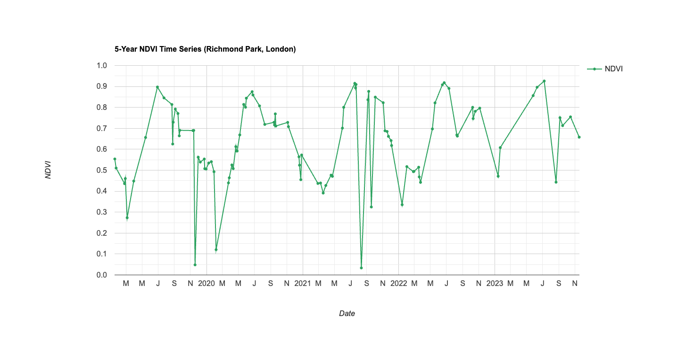

\## Summary

This week marked a critical transition from local, hardware-dependent processing (e.g., in R or QGIS) to cloud-based, planetary-scale analysis using \*\*Google Earth Engine (GEE)\*\*. The core of this week’s learning was understanding GEE's fundamental architecture, specifically the distinction between the \*\*Client-side\*\* and the \*\*Server-side\*\*.

Key conceptual shifts included:

[\*]{.underline} \*\*The Client/Server Model:\*\* The JavaScript code written in the browser (Client) acts merely as a set of instructions. These instructions are sent to Google's supercomputers (Server), where the heavy lifting occurs, and only the final visualised pixels or statistics are returned.
[\*]{.underline} \*\*Iteration without Loops:\*\* I learned to abandon traditional \`for-loops\`—which are inefficient and prone to crashing when handling large spatial datasets—in favour of the \`.map()\` function. This allows operations (like cloud masking) to be applied across thousands of images simultaneously.
[\*]{.underline} \*\*Reducers and Scale:\*\* GEE handles spatial and temporal aggregation through \*Reducers\* (e.g., using \`.median()\` to composite a cloud-free image). Crucially, GEE employs a \*\*pyramiding policy\*\*, dynamically adjusting the computation scale (resolution) based on the zoom level, which is fundamentally different from static local processing.

## Application

While my Week 4 diary explored the \*spatial\* distribution of urban indices, the true analytical power of an \`ee.ImageCollection\` lies in its \*temporal\* depth. To demonstrate this, I applied this week's concepts to monitor the long-term vegetation dynamics of Richmond Park, London.

Instead of downloading gigabytes of Sentinel-2 data to plot a trend locally, I used GEE’s \`ui.Chart\` function alongside a temporal Reducer to instantly process 5 years of surface reflectance data (2019–2023) directly on the server.

::: {#fig-chart}
\{width=85% fig-align="center"}

Figure 1: A 5-year NDVI time-series chart for Richmond Park, generated directly in GEE. The chart captures the seasonal phenology (summer peaks and winter troughs) and allows policymakers to identify abnormal drops in vegetation health due to specific climatic events.
:::

This application proves that GEE is not merely a mapping tool, but a highly efficient \*\*monitoring dashboard\*\*. For policymakers (referencing last week's focus on the London Plan), such temporal charts provide immediate evidence on whether urban greening initiatives are thriving or degrading over the years.

## Reflection

Reflecting on this week's coding exercises, my "Aha!" moment was realising the sheer scale of computation happening behind the scenes. In previous weeks, downloading, atmospheric correcting, and processing a single Landsat scene in R required significant time and memory. In GEE, computing a 5-year NDVI trend takes mere seconds.

The most profound takeaway is the \*\*democratisation of spatial data\*\*. GEE removes the financial and hardware barriers to Earth Observation. A researcher or a local municipality in a developing nation with only a basic laptop and an internet connection now has the exact same analytical power as a well-funded western institution.

However, critical evaluation is necessary. GEE relies on a highly specific JavaScript API, resulting in a steep learning curve and a significant risk of \*\*"vendor lock-in"\*\*—relying entirely on Google's proprietary infrastructure. If Google decides to charge for this service or alter the API, decades of open-source research workflows could be disrupted. Furthermore, while GEE excels at pixel-based algebra and data reduction (turning petabytes into megabytes), traditional topological vector operations (like complex spatial joins or network analysis) are still better suited for desktop GIS software.

Moving forward, I view GEE as the ultimate "first step" in the spatial pipeline: a tool to reduce planetary data into manageable trends and layers, which can then be exported for fine-tuned, localised policy analysis.
