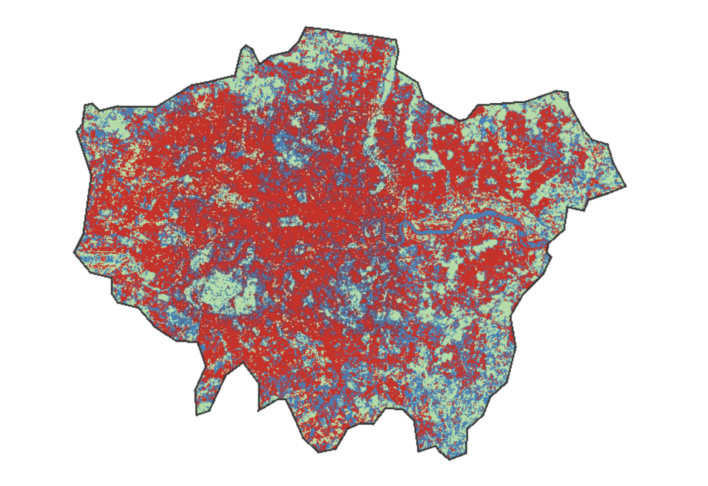

## Summary

This week marked a conceptual shift from calculating continuous pixel values (like NDVI or LST) to categorising pixels into discrete **Land Use/Land Cover (LULC)** classes using Machine Learning (ML). The core focus was on **Supervised Classification**, where an algorithm is trained on labelled data to identify features based on their spectral signatures.

We explored various classifiers, with a strong emphasis on the **Random Forest (RF)** algorithm. Unlike a single **Decision Tree (CART)**, which is prone to overfitting and highly sensitive to training data anomalies, a Random Forest creates an "ensemble" of many independent trees through **Bagging (Bootstrap Aggregating)**. By taking the "majority vote" from these trees, RF significantly improves classification stability and accuracy. As highlighted in the lecture, there is an inherent **interpretability-accuracy tradeoff**: while RF provides higher accuracy, it operates more as a "black box" compared to the transparent logic of a single decision tree.

## Application: From Spectral Confusion to Refined Mapping

To implement the RF algorithm, I utilised Google Earth Engine (GEE) to classify Greater London into three primary classes: **Water** (blue), **Urban** (red), and **Vegetation** (green). My methodology involved an iterative refinement process to overcome initial technical hurdles.

::: {layout-ncol="2"}
{#fig-initial fig-align="left"}

{#fig-final fig-align="right"}
:::

Figure 1: Comparison of Machine Learning iterations. The refined model (right) effectively resolved the initial misclassification of urban shadows as water bodies.

To resolve this, I re-engineered the model by:

1.  **Incorporating the NDWI band:** Adding the Normalized Difference Water Index forced a spectral separation between aquatic features and terrestrial shadows.

2.  **Targeted Sampling:** I provided the Random Forest with specific "shadow-urban" training points, teaching the model to recognise that dark pixels within high-density built environments are statistically more likely to be shadows than water bodies.

**Figure 1:** Comparison of Machine Learning iterations in GEE.

As observed in initial, the initial pixel-based model suffered from significant **Spectral Confusion**. Because the model only examined individual 10m cells in isolation, it failed to distinguish between the low-reflectance values of **building shadows** in Central London and the **River Thames**, resulting in a "noisy" and geographically inaccurate "flooded" output.

## Reflection

The most striking lesson this week was the absolute truth of the **"Garbage In, Garbage Out" (GIGO)** principle. Despite its mathematical sophistication, the Random Forest algorithm is entirely at the mercy of the training data's purity and representative power.

Pixel-based classification inherently lacks **Spatial Context**. It processes each pixel as a silo, which is why it struggles with the "salt-and-pepper" noise seen in my first attempt. This week taught me that as a spatial analyst, my role is not just to "run the code," but to critically interrogate the spectral overlap between classes and validate outputs against geographical reality. This experience provides a perfect logical bridge to **Week 7**, where I will move beyond isolated pixels to explore **Object-Based Image Analysis (OBIA)** to further refine these spatial boundaries.
