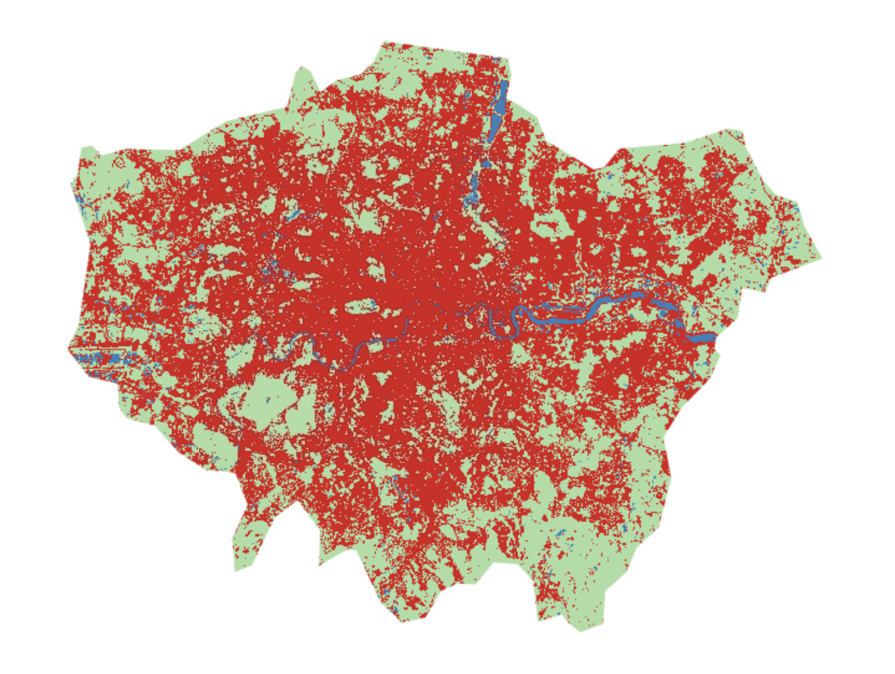

## Summary

This week shifted from computing continuous spectral indices (NDVI, LST) to the fundamentally different task of assigning each pixel to a **discrete Land Use/Land Cover (LULC) class** using supervised machine learning. The conceptual framework centres on the idea of **feature space**: each pixel is represented as a point in an n-dimensional space defined by its band values (and any derived features such as texture or indices), and the classifier's job is to partition that space into regions corresponding to different land cover types.

The lecture introduced a progression of classifiers with increasing complexity. A **Classification and Regression Tree (CART)** partitions feature space through a sequence of binary splits, choosing at each node the variable and threshold that maximally separates the classes — typically measured by Gini impurity or information gain. CART is transparent and interpretable (each decision can be traced through the tree), but suffers from **overfitting**: a fully grown tree memorises the training data, including its noise, and generalises poorly to unseen data [@jensen2015]. **Random Forest (RF)** addresses this through **bagging (bootstrap aggregating)** — growing hundreds of independent trees on randomly sampled subsets of both observations and features, then aggregating their predictions through majority vote. This ensemble approach dramatically reduces variance at the cost of interpretability: the forest produces better predictions, but the decision pathway for any individual pixel becomes opaque.

A critical concept introduced this week is the **train-test split**. Training accuracy (resubstitution accuracy) — where the model is evaluated on the same data it was trained on — is almost always inflated and misleading. The practical demonstrated that a model reporting 99% resubstitution accuracy could perform substantially worse on held-out validation data, particularly when the split is done at the **polygon level** rather than the pixel level. The reason is subtle but important: if training and testing polygons are spatially adjacent or drawn from the same land cover patch, they share spatial autocorrelation — neighbouring pixels are statistically similar — meaning the test data is not truly independent. Splitting at the pixel level within randomly generated points partially mitigates this, though true spatial cross-validation (which the practical did not cover) would be more rigorous.

The **accuracy assessment** framework uses a confusion matrix (or error matrix) to compute overall accuracy, producer's accuracy (the probability that a reference pixel is correctly classified — related to omission error), and consumer's accuracy (the probability that a classified pixel matches the reference — related to commission error) [@barsi2018]. An overall accuracy of 95% can mask severe class-specific failures: if "bare earth" is systematically misclassified as "urban," the consumer's accuracy for urban will be inflated while the producer's accuracy for bare earth collapses. This is why reporting only overall accuracy, without the full confusion matrix and class-specific metrics, is considered insufficient in the remote sensing literature.

------------------------------------------------------------------------

## Application

I implemented a Random Forest classification of **Greater London** in GEE using Sentinel-2 surface reflectance, classifying the study area into three primary classes: **Water**, **Urban**, and **Vegetation**. The workflow followed the practical structure — drawing training polygons, extracting band values, training the classifier, and applying it to the full image — but revealed an instructive failure in the initial iteration.

::: {layout-ncol="2"}
{#fig-initial}

{#fig-refined}
:::

The initial result (@fig-initial) suffered from **spectral confusion** between water and shadow pixels. Both have low reflectance across visible bands, making them spectrally near-identical in feature space when only the standard Sentinel-2 bands are used. The classifier, processing each 10 m pixel in isolation with no spatial context, had no way to determine whether a dark pixel in Canary Wharf was a shadow cast by a skyscraper or a water body — both looked the same in the six-dimensional spectral space.

To resolve this, I re-engineered the model in two ways:

**First, I added the Normalised Difference Water Index (NDWI)** as an additional input band. NDWI exploits the fact that water has distinctively high reflectance in the green band relative to NIR, while shadows do not — creating spectral separation in a dimension that the raw bands alone could not provide:

```{js, eval=FALSE}
// Add NDWI band to force spectral separation between water and shadow
var addNDWI = function(image) {
  var ndwi = image.normalizedDifference(['B3', 'B8']).rename('NDWI');
  return image.addBands(ndwi);
};

var composite = sentinel2_collection.map(addNDWI).median().clip(london);

// Bands used for classification — now including NDWI
var bands = ['B2', 'B3', 'B4', 'B5', 'B6', 'B7', 'B8', 'NDWI'];
```

**Second, I provided targeted training samples** — specifically drawing "shadow-urban" polygons over known shadow areas within dense built-up zones and labelling them as urban rather than water. This forced the RF to learn that dark pixels surrounded by high-reflectance built surfaces are contextually different from dark pixels adjacent to other water features.

The refined result (@fig-refined) shows substantially improved classification, with the Thames correctly delineated and shadow-induced noise largely eliminated. This iterative process illustrates a broader point made by @pal2005: the performance of any supervised classifier is bounded less by the algorithm itself than by the **quality and representativeness of the training data** and the **feature engineering** choices that define the input space. Adding NDWI did not change the classifier — it changed the geometry of feature space in a way that made the classification problem easier to solve.

The practical also demonstrated the importance of **pixel-level versus polygon-level train-test splitting**. When the split was performed at the polygon level with only a small number of training polygons, the RF produced a visually worse classification with paradoxically high reported accuracy — because the few test polygons happened to be spectrally unambiguous. Switching to pixel-level splitting with 1,000 random points per class produced a more reliable accuracy estimate (\~95% overall accuracy) and a visually superior classification, confirming that **sample size and spatial independence of training data matter as much as classifier choice**.

------------------------------------------------------------------------

## Reflection

The most instructive moment this week was the initial classification failure. Seeing central London "flooded" by misclassified shadow pixels made the **"garbage in, garbage out" principle** viscerally concrete: a mathematically sophisticated 100-tree Random Forest, trained on spectrally ambiguous data, will confidently produce nonsensical outputs. The algorithm has no concept of geographic plausibility — it does not "know" that Canary Wharf is not underwater. This matters because automated classification at scale (e.g., producing annual LULC maps for all London boroughs to monitor Policy G5 compliance) requires **training data that anticipates edge cases**, not just the easy, spectrally distinct classes.

Pixel-based classification inherently lacks **spatial context** — each pixel is classified in isolation, which is why the output exhibits the characteristic "salt-and-pepper" noise where individual pixels are assigned to implausible classes surrounded by a different dominant class. This limitation provides the logical bridge to next week's content on **Object-Based Image Analysis (OBIA)**, which first segments the image into spectrally homogeneous regions and then classifies the segments — incorporating shape, size, and neighbourhood relationships that pixel-based approaches cannot access.

One question this week raised for me is about **transferability**. The RF model I trained on London's Sentinel-2 data in summer 2022 would almost certainly fail if applied to the same area in winter (different phenological state, different shadow geometry) or to a different city (different urban morphology, different vegetation types). @pal2005 note that SVMs can outperform RF in situations with small training samples, but the deeper issue is that supervised classifiers are fundamentally **local and temporal** — they learn the spectral-class relationships present in their training data and cannot generalise beyond that context without retraining. For operational urban monitoring, this means that either training data must be regenerated for each time step (expensive), or the approach must shift toward transfer learning or semi-supervised methods that can adapt to distributional shifts — an active area of research that the module will presumably return to.

------------------------------------------------------------------------
