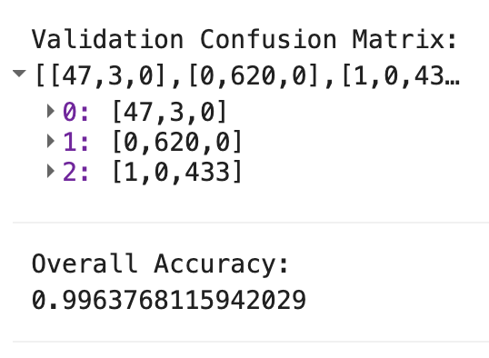
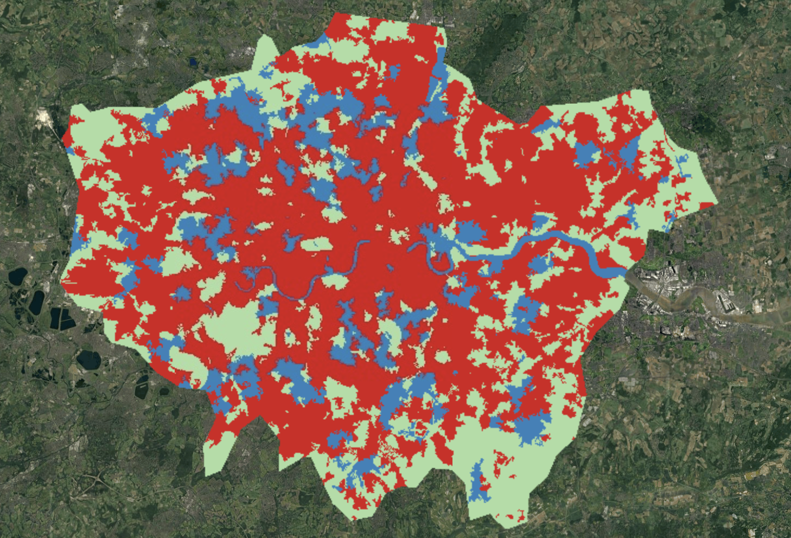

## Summary

This week’s lecture progressed from basic pixel-based Machine Learning to **Object-Based Image Analysis (OBIA)** and the critical evaluation of classification validity.

The primary conceptual shift involved moving away from the assumption that every pixel is independent. Instead, we explored **Simple Non-Iterative Clustering (SNIC)**, which groups pixels into homogenous "superpixels" based on spectral similarity and spatial distance. Furthermore, we addressed **Accuracy Assessment**, learning that a map is only as good as its validation. We moved beyond simple percentages to use **Confusion Matrices**, evaluating **Producer’s Accuracy** (the probability that a ground feature is correctly classified) and **User’s Accuracy** (the reliability of the map for the end user).

## Application

To refine the noisy results from Week 6, I implemented an OBIA approach for Greater London. I utilised the **SNIC algorithm** to segment Sentinel-2 imagery into objects. By adjusting the `compactness` and `seedGrid` parameters, I generated superpixels that adhered more closely to physical urban boundaries, such as the River Thames and large parklands.

::: {layout-ncol="2"}
{#fig-initial}

{#fig-final}
:::

As shown in \@fig-matrix, the model achieved an **Overall Accuracy of 99.6%**. From a technical perspective, this indicates near-perfect alignment between the training data and the classified output. This high-fidelity discrete mapping is essential for urban policy applications, such as tracking **Urban Sprawl** or managing **Greenbelt boundaries**, where contiguous polygons are more useful for legal planning than fragmented pixels.

## Reflection: The Spatial Autocorrelation Pitfall

The most striking lesson from this week was the warning against the **"Illusion of Accuracy."** While a 0.99 OA (Overall Accuracy) appears excellent, it often signals a failure to account for **Spatial Autocorrelation (Tobler’s First Law)**.

In my practical, the validation points were extracted from the same buffered polygons used for training. Because "near things are more related than distant things," the testing data likely provided a **"sneak preview"** of the training signatures, leading to artificially inflated accuracy. As Karasiak et al. (2022) argued, this is a common pitfall in remote sensing.

Furthermore, I engaged with the academic debate regarding the **Kappa Coefficient**. Despite being a standard metric, the lecture highlighted calls to abandon it because its results are often redundant or misinterpreted. This week taught me that as a spatial analyst, my role is to critically interrogate the *statistical independence* of my validation sets rather than simply chasing a perfect score.
